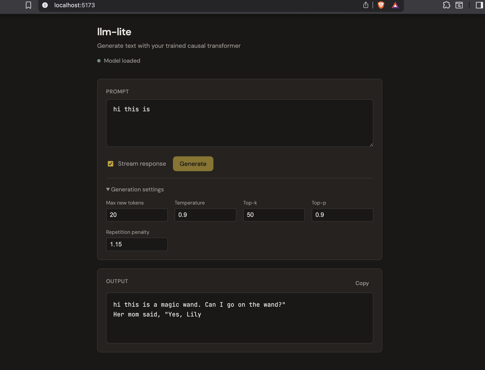

# llm-lite

A from-scratch language model pipeline: **BPE tokenizer → bigram → n-gram → GPT-style transformer**, with a FastAPI inference server and React UI.

Built to understand every layer of how LLMs work — data preparation, tokenization, statistical models, neural architecture, inference optimization, and productionization.

---

## Demo



---

## Benchmark results

| Model | Val loss | Val PPL | Size |
|---|---:|---:|---:|
| Transformer (GPT-style) | 2.35 | **10.49** | 57 MB |
| 3-gram (interpolated) | 3.84 | 46.40 | 7 MB |
| Bigram | 9.90 | 19,993 | 244 MB |

The transformer achieves **19× lower perplexity** than the trigram and **1,900× lower** than the bigram, demonstrating how attention-based context dramatically outperforms fixed windows.

---

## Architecture

```
Raw text
   │
   ▼
prepare_data.py          — download, clean, train/valid split
   │
   ▼
BPE tokenizer (8k vocab) — byte-level, trained on train split only
   │
   ▼
.bin files (uint16)      — token IDs for fast training
   │
   ├──▶ train_bigram.py            — count table, add-α smoothing
   ├──▶ train_ngram.py --n 3       — interpolated n-gram (any N)
   └──▶ train_transformer_causal.py — GPT: 3 layers, 6 heads, 192 dim
              │
              ▼
         model_causal.py           — shared inference + Flash Attention + KV-cache
              │
              ▼
         api/  (FastAPI)           — /v1/generate  /v1/stream (SSE)
              │
              ▼
         ui/   (React + Vite)      — prompt UI with streaming
```

---

## Setup

```bash
git clone <repo>
cd llm-lite
python -m venv .venv && source .venv/bin/activate
pip install -r requirements.txt
pip install -r api/requirements.txt
```

---

## Pipeline

### 1. Prepare data

```bash
python scripts/prepare_data.py
```

Downloads WikiText-2, trains a BPE tokenizer (8k vocab), and writes `data/processed/train.bin` and `valid.bin`.

### 2. Train models

```bash
# Statistical baselines
python scripts/train_bigram.py
python scripts/train_ngram.py --n 3

# GPT-style causal transformer
python scripts/train_transformer_causal.py
```

Resume a stopped run: `python scripts/train_transformer_causal.py --resume`

### 3. Compare all three

```bash
python scripts/compare_models.py
```

### 4. Generate text (no server)

```bash
python scripts/generate_transformer.py --prompt "The history of" --max_new_tokens 150
```

---

## API

```bash
uvicorn api.app.main:app --host 127.0.0.1 --port 8000
```

| Endpoint | Description |
|---|---|
| `GET /healthz` | Model load status |
| `POST /v1/generate` | Full response (blocking) |
| `POST /v1/stream` | Token-by-token SSE stream |
| `GET /docs` | Interactive Swagger UI |

```bash
# One-shot
curl -s -X POST http://127.0.0.1:8000/v1/generate \
  -H "Content-Type: application/json" \
  -d '{"prompt": "The history of", "max_new_tokens": 100}' | python3 -m json.tool

# Streaming
curl -N -X POST http://127.0.0.1:8000/v1/stream \
  -H "Content-Type: application/json" \
  -d '{"prompt": "The history of", "max_new_tokens": 100}'
```

**Generation parameters:**

| Field | Default | Description |
|---|---|---|
| `prompt` | required | Input text |
| `max_new_tokens` | 200 | Tokens to generate |
| `temperature` | 0.9 | Randomness (lower = more focused) |
| `top_k` | 50 | Sample from top-k tokens only |
| `top_p` | 1.0 | Nucleus sampling cutoff |
| `repetition_penalty` | 1.0 | Penalize repeated tokens |
| `seed` | 42 | Reproducibility |

---

## UI

```bash
cd ui && npm install && npm run dev
```

Open [http://localhost:5173](http://localhost:5173). The Vite dev server proxies `/healthz` and `/v1/*` to the API on port 8000.

**Features:** prompt box · stream toggle · generation settings · live streaming cursor · copy button · model status indicator

---

## Docker

```bash
docker compose up --build
```

Serves the UI at [http://localhost:80](http://localhost:80). nginx proxies API traffic so no Vite dev server is needed in production.

---

## Optimizations implemented

| Technique | Where | Effect |
|---|---|---|
| **Flash Attention** | `model_causal.py` | Fused CUDA kernel, O(√T) memory vs O(T²) |
| **KV-cache** | `model_causal.py` | O(1) per decode step vs O(T) without cache |
| **float16 inference** | `model_loader.py` | Halves VRAM on GPU/MPS |
| **Async thread pool** | `api/app/api/routes.py` | Event loop never blocked during inference |
| **CORS middleware** | `api/app/main.py` | Cross-origin UI support |
| **Rate limiting** | `api/app/main.py` | Per-IP request throttling via slowapi |
| **SSE streaming** | API + UI | Tokens appear in real time |
| **Top-p + rep. penalty** | `model_causal.py` | Nucleus sampling, avoids repetition |

---

## Project structure

```
llm-lite/
├── model_causal.py              # GPTMini: Flash Attention, KV-cache, sampling
├── requirements.txt
├── scripts/
│   ├── prepare_data.py          # Data download + BPE tokenizer training
│   ├── train_bigram.py
│   ├── train_ngram.py
│   ├── train_transformer_causal.py
│   ├── generate_transformer.py
│   ├── evaluate_models.py
│   └── compare_models.py
├── api/
│   ├── app/
│   │   ├── main.py              # FastAPI app, CORS, rate limiting
│   │   ├── api/routes.py        # /generate, /stream, /healthz
│   │   ├── api/schemas.py       # Pydantic request/response models
│   │   ├── core/config.py       # pydantic-settings (env vars)
│   │   └── services/
│   │       ├── inference_service.py
│   │       ├── model_loader.py
│   │       └── tokenizer_service.py
│   ├── requirements.txt
│   └── Dockerfile
├── ui/
│   ├── src/
│   │   ├── App.tsx              # Main component
│   │   └── api/client.ts        # fetch + SSE client
│   ├── Dockerfile
│   └── nginx.conf               # Proxies /v1 and /healthz to API
├── docker-compose.yml
└── tokenizer/bpe_tokenizer.json
```
